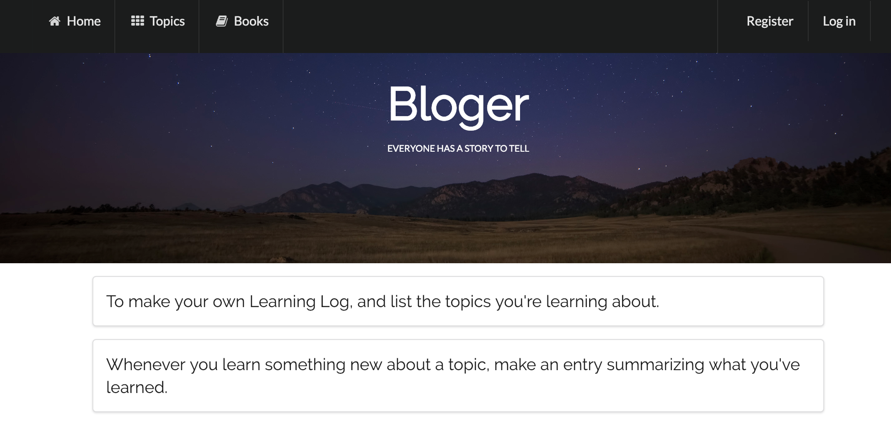
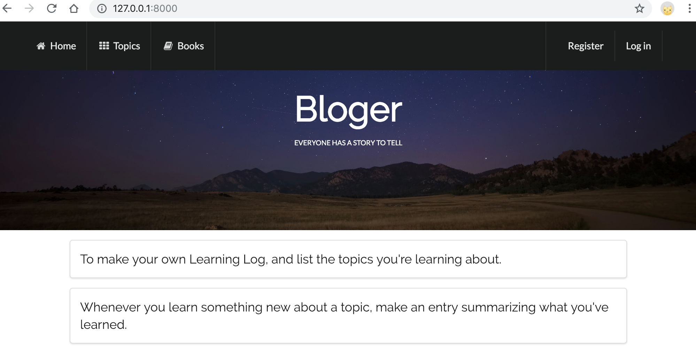

# Django Learning_site

## 00 Requirements

Django== 2.1.4
pytz== 2018.7
Python==3.6.3

## 01 Start a virtual environment

```python
lianli$ python3 -m venv ll_env
```

## 02 Activat the virtual environment

```python
lianli$ source ll_env/bin/activate
```

## 03 Install Django

```python
lianli$ pip install Django
```

## 04 Create a project in Django

```python
lianli$ django-admin.py startproject learning_site .
```

## 05 Create SQL

```python
lianli$ python3 manage.py migrate
```

## 06 Create an app

```python
lianli$ python3 manage.py startapp learning_logs
```

## 07 Create another app

```python
lianli$ python3 manage.py startapp users
```

## 08 Make migrations

```python
lianli$ python3 manage.py makemigrations
```

## 09 Run server

```python
lianli$ python3 manage.py runserver
```

## 10 View learning_site

Copy below link to a web browser, and can see the fresh simple learning site now.

```
http://127.0.0.1:8000/
```


